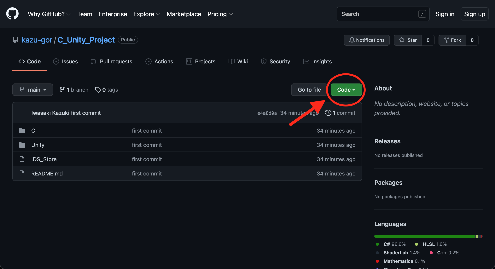
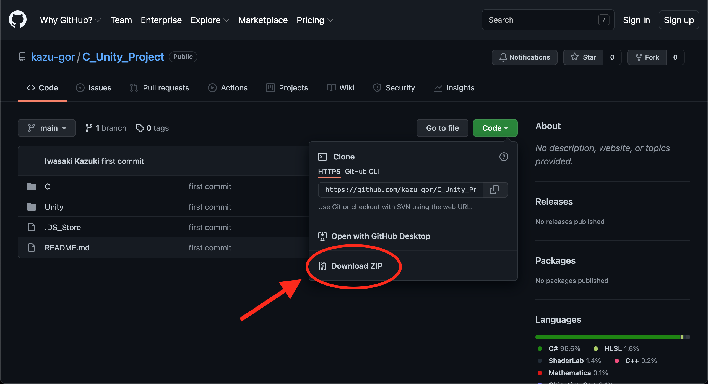

## はじめに

授業で扱ったC言語のソースコードとUnityプロジェクトがここでダウンロードできます。

※ファイル全体のサイズが「**710MB**」と非常に大きいです。お使いのPCに十分な空き容量が確保されていることを確認してからダウンロードすることを推奨します。

## ダウンロードの方法

以下に示す画像の「code」というボタンをクリックします。



すると次のような画面が表示されるので「Download ZIP」を選択。<br>選択するとダウンロードが開始されるので、ダウンロードが完了するまでしばらくお待ち下さい。



## ファイルの説明

```
└─C
  ├─ 6_2_library.cpp
  ├─ :
└─Unity
  ├─ AthleticGame
  ├─ BLockGame
  ├─ Forest
```

Unityについては、フォルダ名はそれぞれ以下のような意味を持ちます。
- AthleticGame：アスレチックのゲーム
- BLockGame：ブロック崩しゲーム
- Forest：森の地形

## 参考サイト一覧

こちら授業をするにあたり、参考にさせていただいたサイト一覧です。
これらの参考サイトに沿って行った授業もいくつかありますので、復習の素材として十分使えるかと思います。

- [3D Game Kit Liteアセットの使い方](https://note.com/npaka/n/n0c9dc4c858c4)
    > Unityでアスレチックを作成する際に使用しました。
- [3D Game Kit Lite](https://assetstore.unity.com/packages/templates/tutorials/3d-game-kit-lite-135162?_ga=2.219472985.196213444.1634317281-2038648567.1630086103)
    > 授業で使用したアセットのストアURLです。
- [【超初心者向け】ブロック崩しを作りながらUnityの基本的な使い方を解説します](https://www.youtube.com/watch?v=muOOLwfbjfs&t=3s)
    > Unityでブロック崩しを作成する際に使用しました。
- [【Unity入門】基本的なUIの作り方とゲームクリア、ゲームオーバーの実装方法を解説します【ひろはす】](https://www.youtube.com/watch?v=J5Tf5-iZcvs)
    > 上のブロック崩しの応用です。おもしろそうだったのですが、時間の都合上省略しました。


